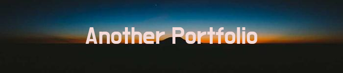
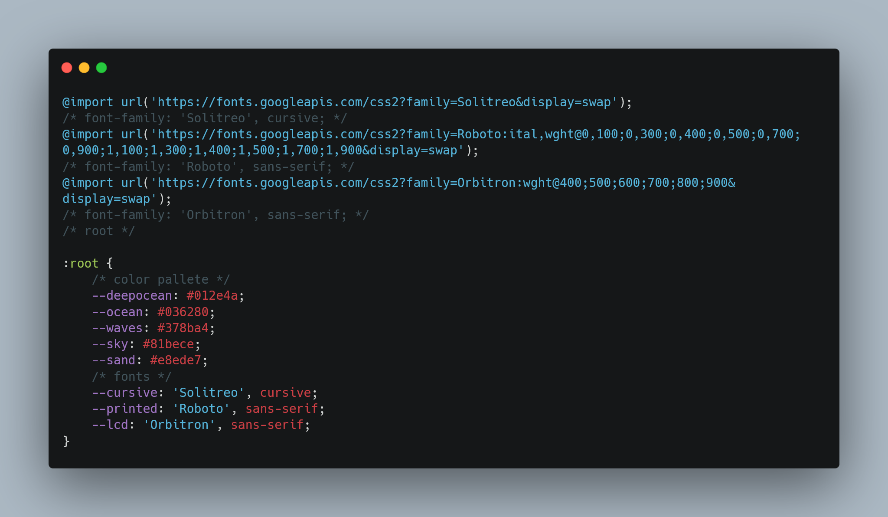

# Another Portfolio #

# Introduction #
When I did my 2nd challenge for BootCamp. I thought of a quirky brand for myself which is AnotherPortfolio.
I know that most of my Central Grader are tired of grading every single portfolio so I figured that if I am going to do anything, it will be the concept but better.

# Quiz Links #
https://timothylai1121.github.io/Quiz-Fever-4/

# Snippet :clapper:

# Languages & FrameWork #

## HTML  

## CSS 

I used to be in management and found a mentor[^1] that helped me bring out my creativity. My favorite language have to be CSS due to this person[^2].

My favorite part of any web development project is bring out different color and style. It is completely opposite from web design but I will be consistent on it

## Javascript  

# References  :bookmark_tabs:

Here is all the reference that I used in this project

| Websites | Urls |
| -------- | ---- |
| Shield.io | [https://shields.io/] |
| Banner Maker | [https://banner.godori.dev/] |
| Javascript & Jquery | [https://javascriptbook.com/] |
| Carbon | [https://carbon.now.sh/] |
| YouTube | [https://www.youtube.com/] |
| StackOverFlow | [https://stackoverflow.com/] |

[^1]: I have include a linkedin link above if you guys are interested in connect with one of my manager.
[^2]: In anyone career path, sometimes you felt like your journey is long but without certain people in my life, I couldn't bring out the best of me. Even though I started in management, without this person, I would not realize how much I love designing. Thank You.

